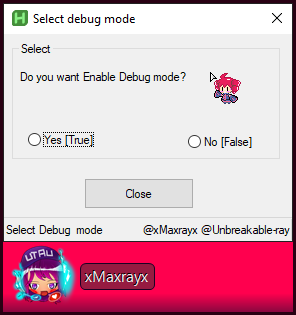

# AHkv2 Library:


Punch of libraries I write it feels free to do whatever you like Under AGPL.3v

<br>

### How to use it?

```
#Include '%A_MyDocuments%\Github_Unbreakable\AHK2-Lib\GUI\debugModeGUI.ahk'
```

Change `\Github_Unbreakable\AHK2-Lib\GUI\debugModeGUI.ahk'` to your Library file location


# GUI:

## debugModeGUI.ahk

Simple Gui to Enable, Disable Debug Mode.




Auto-merged at 08:34:10 PM 2023/07/01	

